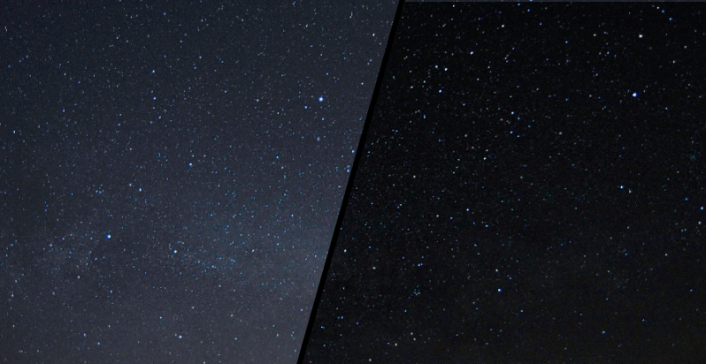
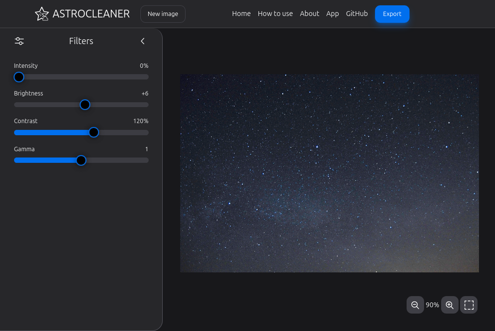

# Astro Cleaner

Remove light pollution from astrography images




Responsive design for both desktop and mobile

Runs locally in browser, no data is saved on the server

### [ 🔗 Live website link -> www.astrocleaner.app](https://www.astrocleaner.app/)



### Usage

1. Upload image or choose a sample
2. Apply filters
    - **Intensity** - intensity of main light pollution filter
    - **Brightness**
    - **Constrast**
    - **Gamma**
3. Save image

## Run project locally

Project is using Vite build tool

1. Download project

```console
git clone https://github.com/scanf-pain/astro-cleaner.git
cd astro-cleaner
```

2. Install dependencies

```console
npm i
```

3. Run

```console
npm run preview
```